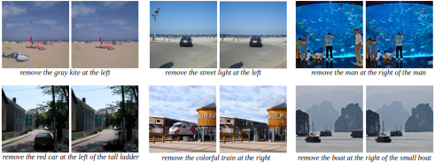

# Inst-Inpaint: Instructing to Remove Objects with Diffusion Models

[Paper](https://arxiv.org/abs/2304.03246) | [Project Website](http://instinpaint.abyildirim.com/) | [Hugging Face Demo](https://huggingface.co/spaces/abyildirim/inst-inpaint) | [BibTeX](#bibtex)



[**Inst-Inpaint: Instructing to Remove Objects with Diffusion Models**](http://instinpaint.abyildirim.com/) <br/>
[Ahmet Burak Yildirim](http://abyildirim.com/),
[Vedat Baday](https://tr.linkedin.com/in/badayvedat),
[Erkut Erdem](https://web.cs.hacettepe.edu.tr/~erkut/),
[Aykut Erdem](https://aykuterdem.github.io/),
[Aysegul Dundar](http://www.cs.bilkent.edu.tr/~adundar/)

**Abstract:** 

Image inpainting task refers to erasing unwanted pixels from images and filling them in a semantically consistent and realistic way. Traditionally, the pixels that are wished to be erased are defined with binary masks. From the application point of view, a user needs to generate the masks for the objects they would like to remove which can be time-consuming and prone to errors.

In this work, we are interested in an image inpainting algorithm that estimates which object to be removed based on natural language input and removes it simultaneously. For this purpose, first, we construct a dataset named **GQA-Inpaint** for this task. Second, we present a novel inpainting framework, **Inst-Inpaint**, that can remove objects from images based on the instructions given as text prompts.

We set various GAN and diffusion-based baselines and run experiments on synthetic and real image datasets. We compare methods with different evaluation metrics that measure the quality and accuracy of the models and show significant quantitative and qualitative improvements.

## News

- GQA-Inpaint pretrained model is released. (June 29, 2023)
- GQA-Inpaint dataset is released. (June 29, 2023)
- Inst-Inpaint training, inference, evaluation, and demo codes are released. (June 29, 2023)
- Hugging Face demo is released. (April 9, 2023)

## Cloning the Repository

```
git clone https://github.com/abyildirim/inst-inpaint.git
cd inst-inpaint
```

## Environment Setup

[Anaconda](https://www.anaconda.com/) is recommended to install the required dependencies. These dependencies are specified in the conda environment named `instinpaint`, which can be created and activated as follows:

```
conda env create -f environment.yaml
conda activate instinpaint
```

## Preparing the GQA-Inpaint Dataset Files

GQA-Inpaint is a real image dataset to train and evaluate models for the instructional image inpainting task. Scene graphs of the [GQA dataset](https://cs.stanford.edu/people/dorarad/gqa/about.html) are exploited to generate paired training data by utilizing state-of-the-art instance segmentation and inpainting methods. Dataset details are explained in the [Inst-Inpaint paper](https://arxiv.org/abs/2304.03246). 

| GQA-Inpaint Content | &nbsp;
| :--- | :----------
| gqa-inpaint | Main dataset folder
| &boxvr;&nbsp; images | Folder of the original images
| &boxvr;&nbsp; images_inpainted | Folder of the inpainted images
| &boxvr;&nbsp; masks | Folder of the inpainted object masks
| &boxvr;&nbsp; train_scenes.json | Scene texts of the training images
| &boxvr;&nbsp; test_scenes.json | Scene texts of the test images
| &boxvr;&nbsp; test_instructions.json | Fixed instructions for testing models

This dataset can facilitate training for both inpainting an object and adding one. For the inpainting task, object relations in the scene JSON files, are modified in the dataset class for creating remove instructions. Also, image relative positions of the target objects in the scene JSON files are found considering the original aspect ratio of the images. These positions are being changed in the dataset class after cropping the images by overwriting them according to the aspect ratio of the cropped images.

ZIP file of the GQA-Inpaint dataset can be downloaded from [Google Drive](https://drive.google.com/file/d/1o-RZH4xeOMiw2Wdrj8ypDQTDgzsyIwYa/view?usp=sharing). The original images of the GQA dataset are not included in the provided ZIP file, which are available on the [GQA website](https://cs.stanford.edu/people/dorarad/gqa/download.html). From the provided link, only the image files (20.3GB) should be downloaded. If the download link is unavailable, the ZIP file can also be downloaded from [Google Drive](https://drive.google.com/file/d/1lHRmUqM7jnj_o6RIoCWwW33fu7fN97vp/view?usp=sharing). Extracted files and folders should be put into the following directory to make the dataset ready to use:

```
inst-inpaint/data/gqa-inpaint/
```

These steps can also be done using the command line. To do so, after activating the environment, apply the following steps to prepare the dataset properly:

```
mkdir data data/gqa-inpaint
cd data/gqa-inpaint
gdown "https://drive.google.com/uc?id=1o-RZH4xeOMiw2Wdrj8ypDQTDgzsyIwYa"
unzip -q gqa-inpaint.zip
rm gqa-inpaint.zip
gdown "https://drive.google.com/uc?id=1lHRmUqM7jnj_o6RIoCWwW33fu7fN97vp"
unzip -q images.zip
rm images.zip
```

## Downloading Pretrained Models

The pretrained model of the GQA-Inpaint dataset can be downloaded from [Google Drive](https://drive.google.com/file/d/1tp0aHAS-ccrIfNz7XrGTSdNIPNZjOVSp/view?usp=sharing). The content of the ZIP file is as below:

| GQA-Inpaint Pretrained Model Content | &nbsp;
| :--- | :----------
| gqa-inpaint | Main model folder
| &boxvr;&nbsp; first_stage | Folder of the first stage (autoencoder) model
| &boxv;&nbsp; &boxur;&nbsp; vq-f8-cb16384-openimages.ckpt| Checkpoint file of the first stage model ([Source](https://github.com/CompVis/taming-transformers#overview-of-pretrained-models))
| &boxur;&nbsp; ldm | Folder of the Latent Diffusion Model (LDM)
| &ensp;&ensp; &boxvr;&nbsp; gqa-inpaint-ldm-vq-f8-256x256.yaml | Config file of the LDM model
| &ensp;&ensp; &boxvr;&nbsp; model.ckpt | Checkpoint file of the LDM model

In the following parts, the commands to run the codes are written by assuming that the ZIP file is extracted to the following directory:

```
inst-inpaint/models/
```

These steps can also be done using the command line. To do so, after activating the environment, apply the following steps:

```
mkdir models
cd models
gdown "https://drive.google.com/uc?id=1tp0aHAS-ccrIfNz7XrGTSdNIPNZjOVSp"
unzip -q gqa_inpaint.zip
rm gqa_inpaint.zip
```

## Training a Model

The training code supports multi-GPU training. An Inst-Inpaint LDM model can be trained on the GQA-Inpaint dataset using four GPUs as follows:

```
python main.py --train --logdir logs --name gqa_inpaint --base configs/latent-diffusion/gqa-inpaint-ldm-vq-f8-256x256.yaml --gpus 0,1,2,3
```

| Args | Description
| :--- | :----------
| --train | Appended to the code to activate the training-related codes.
| --logdir | Directory for saving the training logs.
| --name | Name of the experiment.
| --base | Config file of the model to be trained.
| --gpus | GPU IDs where the model will be trained on.

For training the model on a single GPU, put a comma after the GPU ID.

Note that the GQA-Inpaint model uses a pretrained VQGAN model from [Taming Transformers](https://github.com/CompVis/taming-transformers) repository as the first stage model (autoencoder). Therefore, there is no need to train an autoencoder for this model.

## Inference

In the inference code, the number of DDIM steps is set to 50 and the seed value of image inpainting is set to 0 to obtain the same results for model evaluation. It outputs the source image, target image, inpainted image, and instruction of each sample in the test dataset. 

The inference code can be run for the pretrained model of GQA-Inpaint as follows:  

```
python inference.py --config models/gqa_inpaint/ldm/gqa-inpaint-ldm-vq-f8-256x256.yaml --checkpoint models/gqa_inpaint/ldm/model.ckpt --outdir outputs/gqa_inpaint_inference/
```

| Args | Description
| :--- | :----------
| --config | Model config file path.
| --checkpoint | Model checkpoint file path.
| --outdir | The directory where the outputs will be saved.
| --on_cpu | Append to the command to run the code on the CPU.

## Evaluation

There are two evaluation metrics implemented and used in this study, which are CLIP Accuracy and FID. The following commands can be used to run the evaluation codes on the inference output of the pretrained GQA-Inpaint model. The evaluation results should be as follows:

| Eval Metric | Result
| :--- | :----------
| FID | 5.68
| CLIP@1 | 0.77
| CLIP@3 | 0.64
| CLIP@5 | 0.57

Note that the CLIP accuracy metric considers top N class predictions during the evaluation process. N is set to 1, 3, and 5 in the evaluation script. These metrics are represented as CLIP@N.

### CLIP Accuracy

```
python eval/clip_accuracy.py --test_scene data/gqa-inpaint/test_scenes.json --inference_dir outputs/gqa_inpaint_inference/ --output_dir outputs/gqa_inpaint_eval/ --batch_size 256
```

| Args | Description
| :--- | :----------
| --test_scene | File path of the test scenes.
| --inference_dir | Directory of the inference code outputs.
| --output_dir | The directory where the evaluation results will be saved.
| --batch_size | Batch size of the CLIP forward pass.

### FID

```
python eval/fid.py --inference_dir outputs/gqa_inpaint_inference/ --output_dir outputs/gqa_inpaint_eval/ --batch_size 64
```

| Args | Description
| :--- | :----------
| --inference_dir | Directory of the inference code outputs.
| --output_dir | The directory where the evaluation result will be saved.
| --batch_size | Batch size of the Inception v3 forward pass.

## Gradio Demo

Gradio demo of the pretrained GQA-Inpaint model is available on [Hugging Face Spaces](https://huggingface.co/spaces/abyildirim/inst-inpaint), which is running on CPU. Gradio provides a GUI to run the model on a given sample. In order not to wait in the queue, the demo code can be run locally as follows:

```
python gradio_app/app.py --config models/gqa_inpaint/ldm/gqa-inpaint-ldm-vq-f8-256x256.yaml --checkpoint models/gqa_inpaint/ldm/model.ckpt
```

| Args | Description
| :--- | :----------
| --config | Model config file path.
| --checkpoint | Model checkpoint file path.
| --on_cpu | Append to the command to run the code on the CPU.

## Acknowledgement

Inst-Inpaint codes are implemented on top of the [Latent Diffusion Model](https://github.com/CompVis/latent-diffusion) codebase, which heavily uses the codes from [Guided Diffusion](https://github.com/openai/guided-diffusion) and [Denoising Diffusion Probabilistic Model in Pytorch](https://github.com/lucidrains/denoising-diffusion-pytorch) repositories. It also benefits from the [x-transformers](https://github.com/lucidrains/x-transformers) repository in the implementation of the transformer encoder.

## BibTeX

```
@misc{yildirim2023instinpaint,
      title={Inst-Inpaint: Instructing to Remove Objects with Diffusion Models}, 
      author={Ahmet Burak Yildirim and Vedat Baday and Erkut Erdem and Aykut Erdem and Aysegul Dundar},
      year={2023},
      eprint={2304.03246},
      archivePrefix={arXiv},
      primaryClass={cs.CV}
}
```